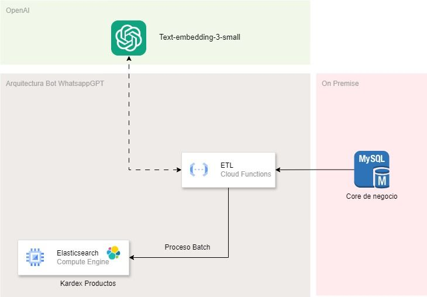

# ETL para Integración de Datos de MySQL a Elasticsearch para Bot de WhatsApp

Este proyecto proporciona un proceso ETL (Extract, Transform, Load) que permite extraer datos desde una base de datos MySQL, transformarlos utilizando embeddings vectorizados, y cargarlos en un índice de Elasticsearch. La información cargada en Elasticsearch está optimizada para el modelo de chatbot en WhatsApp, que utiliza el repositorio [BotWhatsappGPT](https://github.com/macespinoza/BotWhatsappGPT).

---

## Estructura del Proyecto

- **main.py**: Código fuente principal que contiene las funciones para extracción, transformación y carga (ETL) de los datos.
- **requirements.txt**: Lista de las dependencias necesarias para ejecutar el proyecto.
- **mysqlsampledatabase.sql**: Base de datos de muestra en formato SQL para pruebas de desarrollo.

## 🗺️ Arquitectura



## Despliegue en Google Cloud Functions

Este proyecto está diseñado para ser desplegado fácilmente en **Google Cloud Functions**. Sigue estos pasos para el despliegue:

1. **Configura tu entorno de Google Cloud**:
   - Asegúrate de tener un proyecto en Google Cloud.
   - Configura y autentica el SDK de Google Cloud en tu terminal.

## Ejecución en Local o en Otros Ambientes

Si prefieres ejecutar este proyecto en un entorno local u otro ambiente, solo se requieren cambios menores en el archivo `main.py`:

1. **Ajusta las variables de entorno** en `main.py` o utiliza un archivo `.env` para definir los valores de conexión a MySQL y Elasticsearch.
2. **Instala las dependencias** localmente:
   ```bash
   pip install -r requirements.txt
   ```
3. **Ejecución**:
   ```bash
   python main.py
   ```

La ejecución local permite realizar pruebas y ajustes de desarrollo antes de desplegar en Google Cloud Functions.

## Configuración

Antes de ejecutar el script, asegúrate de actualizar las configuraciones necesarias en `main.py`:

1. **Credenciales de MySQL**: Configura las credenciales y la URL de la base de datos.
2. **Conexión a Elasticsearch**: Asegúrate de que el índice y la configuración de Elasticsearch están definidos.

## Integración con el Bot de WhatsApp

El modelo de chatbot en WhatsApp utiliza la base vectorizada creada por este ETL para mejorar las consultas en lenguaje natural. Puedes encontrar el código del bot en el repositorio: [BotWhatsappGPT](https://github.com/macespinoza/BotWhatsappGPT).

---

---

## 🤝 Conecta conmigo

Gracias por revisar este repositorio.  
Si te interesa colaborar, aprender más o invitarme a dar una charla, puedes escribirme o seguirme en LinkedIn:

[](https://www.linkedin.com/in/mcotrina/)

> IA & Data con propósito
